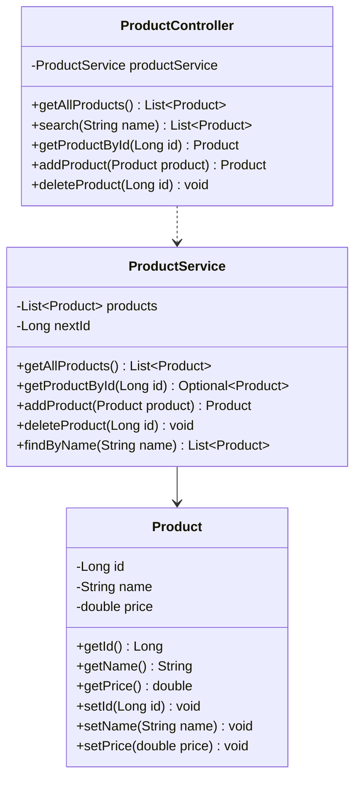

# Tutorial 3 class diagram

```mermaid
classDiagram
  class Product {
    -Long id
    -String name
    -double price
    +getId() Long
    +getName() String
    +getPrice() double
    +setId(Long id) void
    +setName(String name) void
    +setPrice(double price) void
  }
  class ProductService {
    -List~Product~ products
    -Long nextId
    +getAllProducts() List~Product~
    +getProductById(Long id) Optional~Product~
    +addProduct(Product product) Product
    +deleteProduct(Long id) void
    +findByName(String name) List~Product~
  }
  class ProductController {
    -ProductService productService
    +getAllProducts() List~Product~
    +search(String name) List~Product~
    +getProductById(Long id) Product
    +addProduct(Product product) Product
    +deleteProduct(Long id) void
  }
  ProductController ..> ProductService
  ProductService --> Product
```